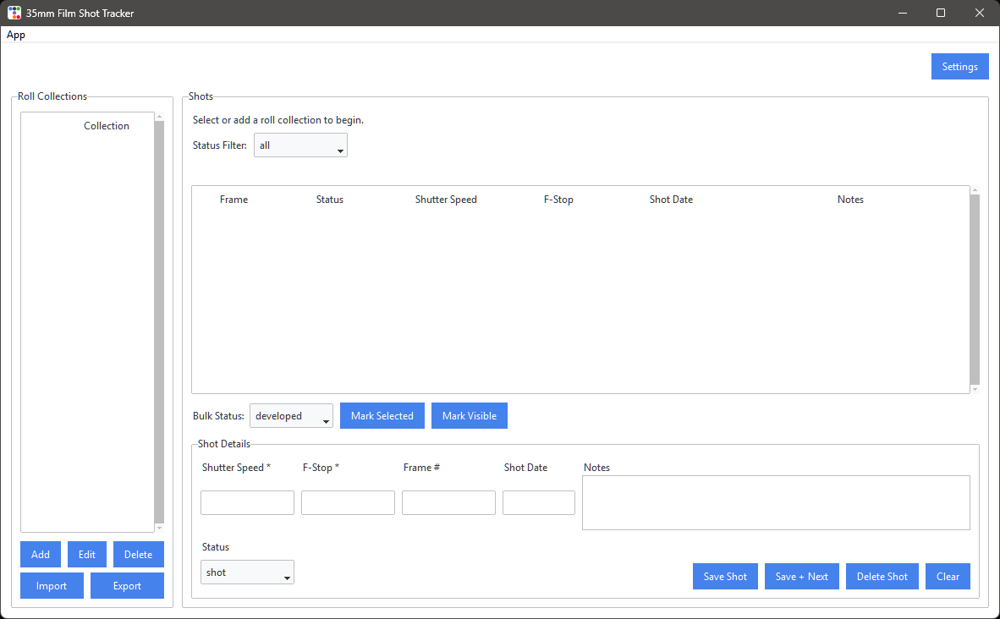

## 35mm Film Shot Tracker

35mm Film Shot Tracker is a full desktop workflow app for logging, organizing, and processing analog film shots by roll.
It helps you track exposure details while shooting, then follow each frame through your post-processing pipeline (`shot` -> `developed` -> `scanned` -> `edited` -> `printed`).

### Application Screenshot



### Features

- Roll collections (for example: Portra 400 - Roll 3)
- Per-collection metadata:
	- Film stock (optional)
	- ISO (optional)
	- Camera (optional)
	- Lens (optional)
	- Lab (optional)
	- Push/pull notes (optional)
- Structured add/edit metadata dialogs for roll collections
- Shot entries inside each collection
- Shot fields:
	- Shutter speed
	- F-stop
	- Frame number (optional)
	- Shot date (optional, `YYYY-MM-DD`)
	- Notes (optional)
	- Multiline notes editor in shot details panel
	- Status (`shot`, `developed`, `scanned`, `edited`, `printed`)
- Status filter (`all` plus each status value)
- Bulk status update actions (`Mark Selected`, `Mark Visible`)
- Quick entry support with `Save + Next` and keyboard shortcut `Ctrl+Enter`
- Preferences window with tabbed settings for defaults, quick entry, metadata display, and workflow tips
- Preferences available from `App` -> `Preferences`
- Camera and lens preset management via list dialogs (`Manage` buttons in Preferences -> Metadata)
- Preset changes are staged in Preferences and saved only when you click `Save`
- ISO date entry field for shot date (`YYYY-MM-DD`)
- Themed UI using `ttkbootstrap` (`litera`)
- CSV export for collection shots
- CSV import for batch shot insertion with row-level validation/conflict summary
- Status-colored shot rows in the table
- Last selected collection restore on app startup
- SQLite persistence at `data/film_tracker.db`
- Delete protection prompts for collections and shots
- Dialog windows open centered over the main app window for consistent UX
- Automatic schema initialization for the current app schema (tracked with SQLite `PRAGMA user_version`)

### Run

1. Ensure Python 3.10+ is installed.
2. Create and activate a virtual environment.

Linux/macOS:

```bash
python3 -m venv .venv
source .venv/bin/activate
```

Windows PowerShell:

```powershell
python -m venv .venv
.\.venv\Scripts\Activate.ps1
```

3. Install dependencies:

```bash
python -m pip install -r requirements.txt
```

4. Start the app:

```bash
python film_tracker.py
```

Dependencies: `ttkbootstrap` (ttk theme engine). `tkinter` and `sqlite3` are from the Python standard library.

### Windows Launcher (`run.bat`)

Run `run.bat` from File Explorer or Command Prompt to:

1. Create `.venv` automatically if it does not exist.
2. Install/update dependencies from `requirements.txt` into `.venv`.
3. Start `film_tracker.py` with `.venv\\Scripts\\python.exe`.
4. Exit the launcher process when the app closes.

```powershell
run.bat
```

This ensures packages are installed into `.venv` (not system Python).

### Data Model

- `collections`
	- `id` (PK)
	- `name`
	- `film_stock` (optional)
	- `iso` (optional)
	- `camera` (optional)
	- `lens` (optional)
	- `lab` (optional)
	- `push_pull` (optional)
	- `capacity` (optional)
	- `created_at`
- `shots`
	- `id` (PK)
	- `collection_id` (FK -> collections.id, cascade delete)
	- `shutter_speed`
	- `f_stop`
	- `frame_number` (optional)
	- `shot_date` (optional)
	- `notes` (optional)
	- `status` (default: `shot`)
	- `created_at`

Frame numbers are unique within the same collection when provided.

### Usage

1. Add a collection from the left panel.
2. (Optional) click `Edit` to update collection name and metadata in a single structured form dialog.
3. Select a collection.
4. Enter shot details in the form on the right.
5. Click `Save Shot` to add a new shot.
6. Use `Save + Next` (or `Ctrl+Enter`) for fast sequential frame entry.
7. Use the status filter and bulk status controls above the shot form as needed.
8. Select an existing shot to edit, then click `Save Shot`.
9. Use `Delete Shot` or `Delete` (collection) to remove data.
10. Open Preferences from `App` -> `Preferences` to customize default status/filter and quick-entry behavior.
11. Configure camera/lens presets from Preferences -> `Metadata` -> `Manage` buttons (list dialogs) and reuse them in add/edit metadata dialogs.
12. Use `Export` in the collections panel to save shots as CSV.
13. Use `Import` in the collections panel to bulk insert shots from CSV.

